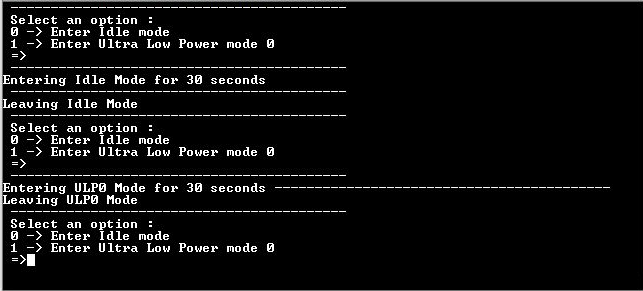

# Low power modes

This example application shows how to enter low power modes of SAMA5D27 MPU.

## Description

The Clock system generates and distributes the clock for the processor and peripherals. This example application shows how device enters in the Idle mode and Ultra low power mode.

## Downloading and building the application

To clone or download this application from Github, go to the [main page of this repository](https://github.com/Microchip-MPLAB-Harmony/csp_apps_sam_a5d2) and then click Clone button to clone this repository or download as zip file.
This content can also be downloaded using content manager by following these [instructions](https://github.com/Microchip-MPLAB-Harmony/contentmanager/wiki).

Path of the application within the repository is **apps/clock/low_power/firmware** .

To build the application, refer to the following table and open the project using its IDE.

| Project Name      | Description                                    |
| ----------------- | ---------------------------------------------- |
| sam_a5d2_xult.X  | [SAMA5D2 Xplained Ultra Evaluation Kit](https://www.microchip.com/DevelopmentTools/ProductDetails/ATSAMA5D2C-XULT) |
|||

## Setting up AT91Bootstrap loader

To load the application binary onto the target device, we need to use at91bootstrap loader. Refer to the [at91bootstrap loader documentation](../../docs/readme_bootstrap.md) for details on how to configure, build and run bootstrap loader project and use it to bootstrap the application binaries.

## Setting up the hardware

The following table shows the target hardware for the application projects.

| Project Name| Board|
|:---------|:---------:|
| sam_a5d2_xult.X  | [SAMA5D2 Xplained Ultra Evaluation Kit](https://www.microchip.com/DevelopmentTools/ProductDetails/ATSAMA5D2C-XULT) |
|||

### Setting up [SAMA5D2 Xplained Ultra Evaluation Kit](https://www.microchip.com/DevelopmentTools/ProductDetails/ATSAMA5D2C-XULT)

#### Setting up the board

- Short jumper JP2 (DEBUG_DIS)
- Connect the USB port J22 on board to the computer using a micro USB cable (to enable debug com port)
- Connect the USB port J7 on board to the computer using a micro USB cable (to power the board)

## Running the Application

1. Build the application using its IDE
2. Open the Terminal application (Ex.:Tera term) on the computer.
3. Connect to the EDBG/Jlink Virtual COM port and configure the serial settings as follows:
    - Baud : 115200
    - Data : 8 Bits
    - Parity : None
    - Stop : 1 Bit
    - Flow Control : None

4. Press '0' in the terminal window
    - Observe the message "Entering Idle Mode for 30 seconds" in the terminal window
    - Wait for 30 seconds and observe the message "Leaving Idle Mode" in the terminal window
5. Press '1' in the terminal window
    - Observe the message "Entering ULP0 Mode for 30 seconds" in the terminal window
    - Wait for 30 seconds and observe the message "Leaving ULP0 Mode" in the terminal window.

     