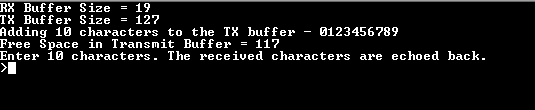
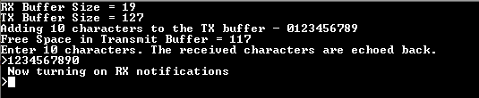
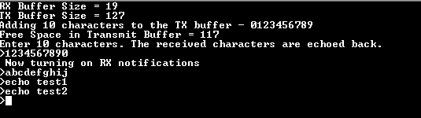

# FLEXCOM USART ring buffer

This example application shows how to use the FLEXCOM peripheral in USART ring buffer mode.

## Description

This example demonstrates read and write over USART using the ring buffer mode. The USART is configured in non-blocking mode (interrupts enabled). The example asks the user to enter 10 characters. Once received, the characters are echoed back. In the process, the example demonstrates various ring buffer APIs.

## Downloading and building the application

To clone or download this application from Github, go to the [main page of this repository](https://github.com/Microchip-MPLAB-Harmony/csp_apps_sam_a5d2) and then click Clone button to clone this repository or download as zip file.
This content can also be downloaded using content manager by following these [instructions](https://github.com/Microchip-MPLAB-Harmony/contentmanager/wiki).

Path of the application within the repository is **apps/flexcom/flexcom_usart_ring_buffer_interrupt/firmware** .

To build the application, refer to the following table and open the project using its IDE.

| Project Name      | Description                                    |
| ----------------- | ---------------------------------------------- |
| sam_a5d2_xult.X | MPLABX project for [SAMA5D2 Xplained Ultra Evaluation Kit](https://www.microchip.com/DevelopmentTools/ProductDetails/ATSAMA5D2C-XULT) |
|||

## Setting up AT91Bootstrap loader

To load the application binary onto the target device, we need to use at91bootstrap loader. Refer to the [at91bootstrap loader documentation](../../docs/readme_bootstrap.md) for details on how to configure, build and run bootstrap loader project and use it to bootstrap the application binaries.

## Setting up the hardware

The following table shows the target hardware for the application projects.

| Project Name| Board|
|:---------|:---------:|
| sam_a5d2_xult.X | [SAMA5D2 Xplained Ultra Evaluation Kit](https://www.microchip.com/DevelopmentTools/ProductDetails/ATSAMA5D2C-XULT) |
|||

### Setting up [SAMA5D2 Xplained Ultra Evaluation Kit](https://www.microchip.com/DevelopmentTools/ProductDetails/ATSAMA5D2C-XULT)

#### Addtional hardware required

- SD Card with FAT32 file system

#### Setting up the SD Card

- Download harmony MPU bootstrap loader from this [location](firmware/at91bootstrap_sam_a5d2_xult.X/binaries/boot.bin)
- Copy the downloaded boot loader binary( boot.bin) onto the SD card

#### Setting up the board

- SDMMC slot used for bootloading the application is SDMMC1
- Short jumper JP2 (DEBUG_DIS)
- Connect the Debug USB port on the board to the computer using a micro USB cable
- Connect [USB UART click board](http://www.mikroe.com/usb-uart-click) to SAM A5D2 Xplained Ultra board as per below Pin Connections

    | SAM A5D2 Xplained Ultra board Pins | [USB UART click board](http://www.mikroe.com/usb-uart-click) Pins |
    | ---------------------------------- | ------------------------- |
    | F0_TXD, J22 connector | RX |
    | F0_RXD, J22 connector | TX |
    | PIN 20, XPRO EXT2 connector | 3.3V |
    | PIN 19, XPRO EXT2 connector | GND |

- Connect the Mini USB connector on the [USB UART click board](http://www.mikroe.com/usb-uart-click) to the computer using a Mini USB cable

## Running the Application

1. Build the application using its IDE
2. Copy the output binary (named 'harmony.bin') onto the SD Card (Refer to the 'Setting up hardware' section above for setting up the SD card)
3. Insert the SD card into SDMMC slot on the board (Refer to the 'Setting up hardware' section for the correct SDMMC slot)
4. Open the Terminal application (Ex.:Tera term) on the computer.
5. Connect to the EDBG/Jlink Virtual COM port and configure the serial settings as follows:
    - Baud : 115200
    - Data : 8 Bits
    - Parity : None
    - Stop : 1 Bit
    - Flow Control : None
6. Reset the board to run the application
7. The console displays the following message

    

    - Console displays the initial transmit and receive buffer sizes
    - It then adds 10 characters - "0123456789" to the transmit buffer and displays the available free space in the transmit buffer after the 10 characters have been added
    - The message asks the user to enter 10 characters
    - *NOTE: For this example, the "Free Space in Transmit Buffer = xx", where xx can be anything between 117 to 127, depending on the USART baud rate and the CPU execution speed*

8. Enter 10 characters on the terminal
9. Entered characters are echoed back on the console and message is displayed indicating that the receive notification is turned on

    

10. For every 10 characters typed, it will be echoed back on the console

    
