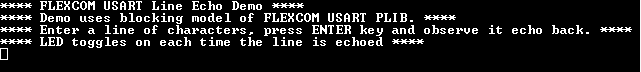

# FLEXCOM USART blocking

This example application shows how to use the flexcom module in USART mode.

## Description

This application configures the flexcom peripheral in USART mode and performs read and write operation in a blocking manner. The CPU polls the peripheral register continuously to manage the transfer. It receives a line of characters from the terminal window and echoes them back.

## Downloading and building the application

To clone or download this application from Github, go to the [main page of this repository](https://github.com/Microchip-MPLAB-Harmony/csp_apps_sam_a5d2) and then click Clone button to clone this repository or download as zip file.
This content can also be downloaded using content manager by following these [instructions](https://github.com/Microchip-MPLAB-Harmony/contentmanager/wiki).

Path of the application within the repository is **apps/flexcom/usart/flexcom_usart_echo_blocking/firmware** .

To build the application, refer to the following table and open the project using its IDE.

| Project Name      | Description                                    |
| ----------------- | ---------------------------------------------- |
| sam_a5d2_curiosity.X | MPLABX project for [SAMA5D29 Curiosity Development Board](https://www.microchip.com/en-us/development-tool/EV07R15A) |
|||

## Setting up AT91Bootstrap loader

To load the application binary onto the target device, we need to use at91bootstrap loader. Refer to the [at91bootstrap loader documentation](../../../docs/readme_bootstrap.md) for details on how to configure, build and run bootstrap loader project and use it to bootstrap the application binaries.

## Setting up the hardware

The following table shows the target hardware for the application projects.

| Project Name| Board|
|:---------|:---------:|
| sam_a5d2_curiosity.X | [SAMA5D29 Curiosity Development Board](https://www.microchip.com/en-us/development-tool/EV07R15A) |
|||

### Setting up [SAMA5D29 Curiosity Development Board](https://www.microchip.com/en-us/development-tool/EV07R15A)

#### Addtional hardware required

- [USB UART click board](http://www.mikroe.com/usb-uart-click)

#### Setting up the board

- Connect the Debug USB port on the board to the computer using a micro USB cable
- Connect [USB UART click board](http://www.mikroe.com/usb-uart-click) to SAM A5D29 Curiosity board as per below Pin Connections

    | SAM A5D29 Curiosity board Pins | [USB UART click board](http://www.mikroe.com/usb-uart-click) Pins |
    | ---------------------------------- | ------------------------- |
    | PIN 5, J8 connector | RX |
    | PIN 4, J8 connector | TX |
    | PIN 7, mikroBUS1 connector | 3.3V |
    | PIN 1, J8 connector | GND |

- Connect the Mini USB connector on the [USB UART click board](http://www.mikroe.com/usb-uart-click) to the computer using a Mini USB cable

## Running the Application

1. Build the application using its IDE
2. Open the Terminal application (Ex.:Tera term) on the computer.
3. Connect to the SERIAL COM port and configure the serial settings as follows:
    - Baud : 115200
    - Data : 8 Bits
    - Parity : None
    - Stop : 1 Bit
    - Flow Control : None
4. The console displays the following message

    

5. Type a line of characters and press the Enter key (*NOTE: Number of characters entered before pressing enter key must be less than 256*))
6. Entered line will be echoed back and the LED is toggled
7. The following table provides the LED names

    | Board      | LED Name                                    |
    | ----------------- | ---------------------------------------------- |
    | [SAMA5D29 Curiosity Development Board](https://www.microchip.com/en-us/development-tool/EV07R15A) | RGB_LED(Green) |
    |||
