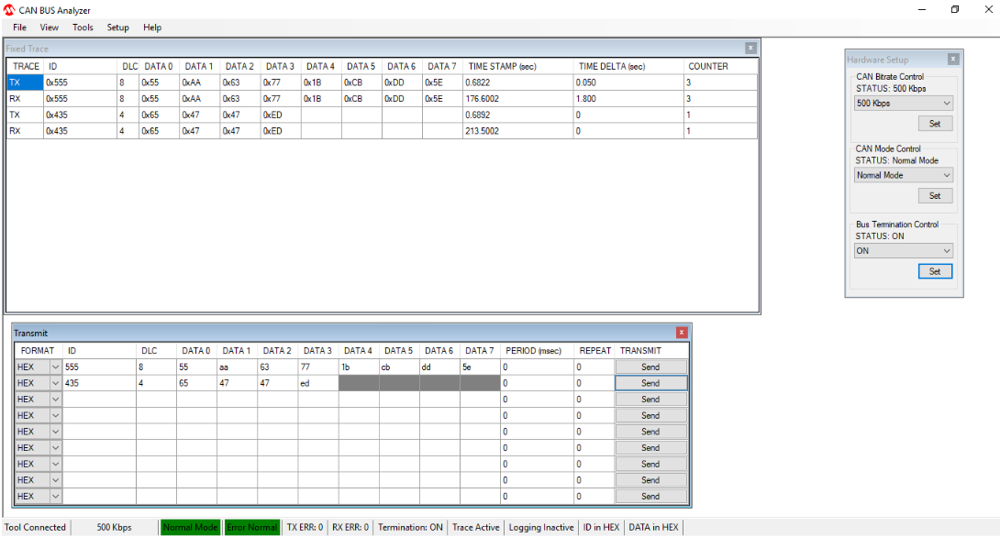
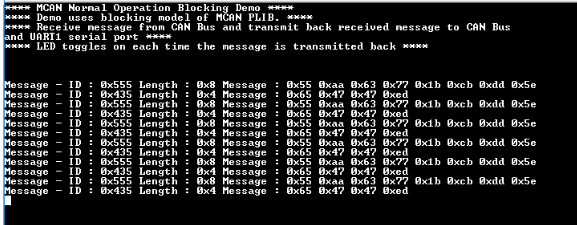

# MCAN blocking

This example application shows how to use the MCAN module to transmit and receive CAN messages in polling mode.

## Description

This application transmits and receives CAN messages on the CAN bus.  To run this application, an evaluation board and [Microchip CAN Bus Analyzer](http://www.microchip.com/Developmenttools/ProductDetails/APGDT002) is required . They act as different nodes on the CAN bus. While running the application, user can send and receive CAN messages between the board and the analyzer.

## Downloading and building the application

To clone or download this application from Github, go to the [main page of this repository](https://github.com/Microchip-MPLAB-Harmony/csp_apps_sam_a5d2) and then click Clone button to clone this repository or download as zip file.
This content can also be downloaded using content manager by following these [instructions](https://github.com/Microchip-MPLAB-Harmony/contentmanager/wiki).

Path of the application within the repository is **apps/mcan/mcan_normal_operation_blocking/firmware** .

To build the application, refer to the following table and open the project using its IDE.

| Project Name      | Description                                    |
| ----------------- | ---------------------------------------------- |
| sam_a5d2_xult.X | MPLABX project for [SAMA5D2 Xplained Ultra Evaluation Kit](https://www.microchip.com/DevelopmentTools/ProductDetails/ATSAMA5D2C-XULT) |
|||

## Setting up AT91Bootstrap loader

To load the application binary onto the target device, we need to use at91bootstrap loader. Refer to the [at91bootstrap loader documentation](../../docs/readme_bootstrap.md) for details on how to configure, build and run bootstrap loader project and use it to bootstrap the application binaries.

## Setting up the hardware

The following table shows the target hardware for the application projects.

| Project Name| Board|
|:---------|:---------:|
| sam_a5d2_xult.X | [SAMA5D2 Xplained Ultra Evaluation Kit](https://www.microchip.com/DevelopmentTools/ProductDetails/ATSAMA5D2C-XULT) |
|||

### Setting up [SAMA5D2 Xplained Ultra Evaluation Kit](https://www.microchip.com/DevelopmentTools/ProductDetails/ATSAMA5D2C-XULT)

#### Addtional hardware required

- To run the demo, the following additional hardware are required:
  - [Microchip CAN Bus Analyzer](http://www.microchip.com/Developmenttools/ProductDetails/APGDT002)
  - [ATA6563 click board](https://www.mikroe.com/ata6563-click)

#### Setting up the board

- Install [Microchip CAN Bus Analyzer](http://www.microchip.com/Developmenttools/ProductDetails/APGDT002) software on PC
- Connect [Microchip CAN Bus Analyzer](http://www.microchip.com/Developmenttools/ProductDetails/APGDT002) to [ATA6563 click board](https://www.mikroe.com/ata6563-click) using female to female DB9 serial cable
- Connect [ATA6563 click board](https://www.mikroe.com/ata6563-click) to the SAM A5D2 XULT as per the Pin connections shown below

    | SAMA5D2 XULT | ATA6563 click board |
    | ------------ | ------------------- |
    | CANTX0 (PIN8), J9 Connector | RX (PIN 14) |
    | CANRX0 (PIN7), J9 Connector | TX (PIN 13) |
    | 3V3 (PIN20), EXT1 Connector | 3V3 (PIN 7) |
    | VDD_5V (PIN3), J24 Connector | 5V (PIN 10) |
    | GND (PIN19), EXT1 Connector | GND (PIN 9) |
    |||

- Connect [Microchip CAN Bus Analyzer](http://www.microchip.com/Developmenttools/ProductDetails/APGDT002) to PC using USB Male-A to Male Mini-B cable
- Short jumper JP2 (DEBUG_DIS)
- Connect the Debug USB port on the board to the computer using a micro USB cable

## Running the Application

1. Build the application using its IDE
2. Open the Terminal application (Ex.:Tera term) on the computer.
3. Connect to the EDBG/Jlink Virtual COM port and configure the serial settings as follows:
    - Baud : 115200
    - Data : 8 Bits
    - Parity : None
    - Stop : 1 Bit
    - Flow Control : None
4. Open the CAN Analyzer Software and perform following steps
    - Configure CAN Analyzer Software as per Hardware Setup mention in below screenshot

    

    - Send CAN message from CAN Analyzer Software

5. Received message will be echoed back to the CAN analyzer software and terminal window
6. Following will be terminal session’s output

    

7. LED toggles for every message received

Following table provides LED name:

| Board      | LED Name                                    |
| ----------------- | ---------------------------------------------- |
| [SAMA5D2 Xplained Ultra Evaluation Kit](https://www.microchip.com/DevelopmentTools/ProductDetails/ATSAMA5D2C-XULT) |RGB_LED(Green)  |
|||
