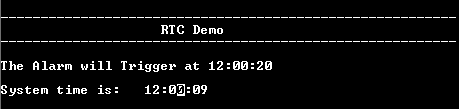
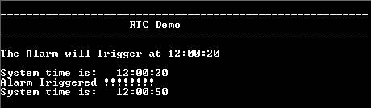

# RTC alarm interrupt

This example application shows how to use the RTC to configure the time and generate the alarm.

## Description

This example application shows how to setup system time and configure alarm using the RTC Peripheral Library. The application sets up an alarm to be generated after 20 seconds of the configured system time. The application displays a message on the alarm trigger.

## Downloading and building the application

To clone or download this application from Github, go to the [main page of this repository](https://github.com/Microchip-MPLAB-Harmony/csp_apps_sam_a5d2) and then click Clone button to clone this repository or download as zip file.
This content can also be downloaded using content manager by following these [instructions](https://github.com/Microchip-MPLAB-Harmony/contentmanager/wiki).

Path of the application within the repository is **apps/rtc/rtc_alarm/firmware** .

To build the application, refer to the following table and open the project using its IDE.

| Project Name      | Description                                    |
| ----------------- | ---------------------------------------------- |
| sam_a5d2_xult.X | MPLABX project for [SAMA5D2 Xplained Ultra Evaluation Kit](https://www.microchip.com/DevelopmentTools/ProductDetails/ATSAMA5D2C-XULT) |
|||

## Setting up AT91Bootstrap loader

To load the application binary onto the target device, we need to use at91bootstrap loader. Refer to the [at91bootstrap loader documentation](../../docs/readme_bootstrap.md) for details on how to configure, build and run bootstrap loader project and use it to bootstrap the application binaries.

## Setting up the hardware

The following table shows the target hardware for the application projects.

| Project Name| Board|
|:---------|:---------:|
| sam_a5d2_xult.X | [SAMA5D2 Xplained Ultra Evaluation Kit](https://www.microchip.com/DevelopmentTools/ProductDetails/ATSAMA5D2C-XULT) |
|||

### Setting up [SAMA5D2 Xplained Ultra Evaluation Kit](https://www.microchip.com/DevelopmentTools/ProductDetails/ATSAMA5D2C-XULT)

#### Setting up the board

- Short jumper JP2 (DEBUG_DIS)
- Connect the Debug USB port on the board to the computer using a micro USB cable

## Running the Application

1. Build the application using its IDE
2. The console displays the current time and the alarm time (System time starts at 12:00:00 and gets updated every second)

    

3. Once the alarm time is reached, it print the alarm message and turns on the LED (System time keeps updating)

    

Refer to the following table for LED name:

| Board      | LED Name                                    |
| ----------------- | ---------------------------------------------- |
| [SAMA5D2 Xplained Ultra Evaluation Kit](https://www.microchip.com/DevelopmentTools/ProductDetails/ATSAMA5D2C-XULT) |RGB_LED(Blue)  |
|||