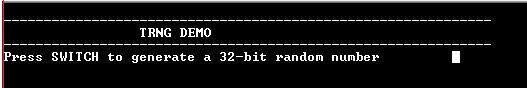
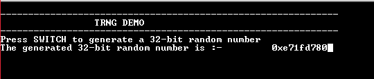

# TRNG random number

This example application shows how to use the TRNG Peripheral library to generate and read a random number.

## Description

This example application shows how to use the TRNG peripheral library to produce a 32-bit true random number. Generated random number can be used as an entropy source for seeding a Deterministic Random Number Generator (DRNG), creating cryptographic keys for ciphers etc.

## Downloading and building the application

To clone or download this application from Github, go to the [main page of this repository](https://github.com/Microchip-MPLAB-Harmony/csp_apps_sam_a5d2) and then click Clone button to clone this repository or download as zip file.
This content can also be downloaded using content manager by following these [instructions](https://github.com/Microchip-MPLAB-Harmony/contentmanager/wiki).

Path of the application within the repository is **apps/trng/random_number/firmware** .

To build the application, refer to the following table and open the project using its IDE.

| Project Name      | Description                                    |
| ----------------- | ---------------------------------------------- |
| sam_a5d2_curiosity.X | MPLABX project for [SAMA5D2 Curiosity]() |
|||

## Setting up AT91Bootstrap loader

To load the application binary onto the target device, we need to use at91bootstrap loader. Refer to the [at91bootstrap loader documentation](../../docs/readme_bootstrap.md) for details on how to configure, build and run bootstrap loader project and use it to bootstrap the application binaries.

## Setting up the hardware

The following table shows the target hardware for the application projects.

| Project Name| Board|
|:---------|:---------:|
| sam_a5d2_curiosity.X | [SAMA5D2 Curiosity]() |
|||

### Setting up [SAMA5D2 Curiosity]()

#### Setting up the board

- Short jumper JP2 (DEBUG_DIS)
- Connect the Debug USB port on the board to the computer using a micro USB cable

## Running the Application

1. Build the application using its IDE
2. The console displays the following message

    

3. Every time the switch is pressed, a new 32 bit random number is generated and displayed on the console

    

Following table provides the switch name:

| Board      | Switch Name  |
| ---------- | ------------ |
| [SAMA5D2 Curiosity]() | PB_USER |
|||
