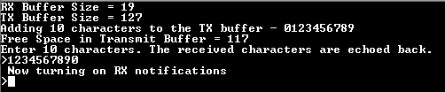
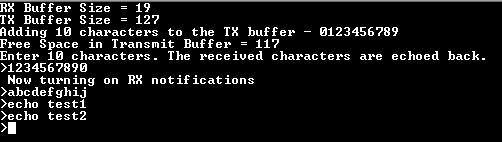

# USART ring buffer

This example application shows how to use USART peripheral in ring buffer mode.

## Description

This example demonstrates read and write over USART using the ring buffer mode. The USART is configured in non-blocking mode (interrupts enabled). The example asks the user to enter 10 characters. Once received, the characters are echoed back. In the process, the example demonstrates various ring buffer APIs.

## Downloading and building the application

To clone or download this application from Github, go to the [main page of this repository](https://github.com/Microchip-MPLAB-Harmony/csp_apps_sam_a5d2) and then click Clone button to clone this repository or download as zip file.
This content can also be downloaded using content manager by following these [instructions](https://github.com/Microchip-MPLAB-Harmony/contentmanager/wiki).

Path of the application within the repository is **apps/uart/uart_ring_buffer_interrupt/firmware** .

To build the application, refer to the following table and open the project using its IDE.

| Project Name      | Description                                    |
| ----------------- | ---------------------------------------------- |
| sam_a5d2_xult.X | MPLABX project for [SAMA5D2 Xplained Ultra Evaluation Kit](https://www.microchip.com/DevelopmentTools/ProductDetails/ATSAMA5D2C-XULT) |
| sam_a5d27_som1_ek.X | MPLABX project for [SAMA5D27-SOM1-EK1](https://www.microchip.com/DevelopmentTools/ProductDetails/atsama5d27-som1-ek1) |
| sam_a5d27_wlsom1_ek1.X | MPLABX project for [SAMA5D27-WLSOM1-EK1] (https://www.microchip.com/DevelopmentTools/ProductDetails/PartNO/DM320117) | 
|||

## Setting up AT91Bootstrap loader

To load the application binary onto the target device, we need to use at91bootstrap loader. Refer to the [at91bootstrap loader documentation](../../docs/readme_bootstrap.md) for details on how to configure, build and run bootstrap loader project and use it to bootstrap the application binaries.

## Setting up the hardware

The following table shows the target hardware for the application projects.

| Project Name| Board|
|:---------|:---------:|
| sam_a5d2_xult.X        | [SAMA5D2 Xplained Ultra Evaluation Kit](https://www.microchip.com/DevelopmentTools/ProductDetails/ATSAMA5D2C-XULT) |
| sam_a5d27_som1_ek.X    | [SAMA5D27-SOM1-EK1 Evaluation Kit] (https://www.microchip.com/DevelopmentTools/ProductDetails/atsama5d27-som1-ek1) |
| sam_a5d27_wlsom1_ek1.X | [SAMA5D27-WLSOM1-EK1 Evaluation Kit] (https://www.microchip.com/DevelopmentTools/ProductDetails/PartNO/DM320117) |
|||

### Setting up [SAMA5D2 Xplained Ultra Evaluation Kit](https://www.microchip.com/DevelopmentTools/ProductDetails/ATSAMA5D2C-XULT)

#### Setting up the board

- Short jumper JP2 (DEBUG_DIS)
- Connect a USB to UART FTDI cable to J1 (DEBUG) to open a serial terminal
- Connecting a micro-USB cable to either J23 or J14 powers the board

### Setting up [SAMA5D27-SOM1-EK1 Evaluation Kit](https://www.microchip.com/DevelopmentTools/ProductDetails/atsama5d27-som1-ek1)

#### Setting up the board

- Connecting a micro-USB cable to J10 both powers the board as well as provides a virtal COM port to open a serial terminal

### Setting up [SAMA5D27-WLSOM1-EK1 Evaluation Kit](https://www.microchip.com/DevelopmentTools/ProductDetails/PartNO/DM320117)

#### Setting up the board

- Connect a USB to UART FTDI cable to J26 (DEBUG FTDI) to open a serial terminal
- Connecting a micro-USB cable to J10 powers the board
- Press the SW3 (nSTART_SOM) button to power the ATSAMA5D27-WLSOM1 System-On-Module

## Running the Application

1. Build the application using its IDE
2. Open the Terminal application (Ex.:Tera term) on the computer.
3. Connect to the EDBG/Jlink Virtual COM port and configure the serial settings as follows:
    - Baud : 115200
    - Data : 8 Bits
    - Parity : None
    - Stop : 1 Bit
    - Flow Control : None
4. The console displays the following message

    

    - The console displays the initial transmit and receive buffer sizes
    - It then adds 10 characters - "0123456789" to the transmit buffer and displays the available free space in the transmit buffer after the 10 characters have been added
    - The message asks the user to enter 10 characters
    - *NOTE: For this example, the "Free Space in Transmit Buffer = xx", where xx can be anything between 117 to 127, depending on the USART baud rate and the CPU execution speed*

5. Enter 10 characters on the terminal
6. Entered characters are echoed back on the console and message is displayed indicating that the receive notification is turned on

    

7. For every 10 characters typed, it will be echoed back on the console

    
