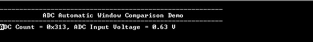

# ADC Automatic Window Comparison

This example application shows how to sample an analog input in polled mode and send the  converted data to console using automatic window comparison of converted values.

**Parent topic:**[Harmony 3 Peripheral Library Application Examples for SAMA5D2 Family](GUID-3730E5D6-911C-4BCA-9955-26D7EB66B585.md)

## Description

This example application shows how to use the ADC Peripheral library to perform  automatic window comparison of converted values.

The ADC peripheral is configured to operate in window mode. In this example, Analog  input voltage in the range of 0V to 3.3V is fed to the ADC input channel AD0. The  ADC conversion is triggered by software and converted result is displayed on the  console whenever input voltage goes below window lower threshold.

## Downloading and Building the Application

To clone or download this application from Github, go to the [main page of this repository](https://github.com/Microchip-MPLAB-Harmony/csp_apps_sam_a5d2) and then  click Clone button to clone this repository or download as zip file. This content  can also be downloaded using content manager by following these [instructions](https://github.com/Microchip-MPLAB-Harmony/contentmanager/wiki).

Path of the application within the repository is  **apps/adc/adc\_automatic\_window\_comparison/firmware**.

To build the application, refer to the following table and open the project using its  IDE.

|Project Name|Description|
|------------|-----------|
|sam\_a5d2\_curiosity.X|MPLABX project for [SAMA5D29 Curiosity Development Board Kit](https://www.microchip.com/en-us/development-tool/EV07R15A)|

## Setting Up AT91Bootstrap Loader

To load the application binary onto the target device, we need to use at91bootstrap  loader. Refer to the [at91bootstrap loader documentation](GUID-DA6B998E-C5DD-4566-BB08-7DC124553FBF.md) for  details on how to configure, build and run bootstrap loader project and use it to  bootstrap the application binaries.

## Setting Up the Hardware

The following table shows the target hardware for the application projects.

|Project Name|Description|
|------------|-----------|
|sam\_a5d2\_curiosity.X|[SAMA5D29 Curiosity Development Board Kit](https://www.microchip.com/en-us/development-tool/EV07R15A)|

### Setting Up SAMA5D29 Curiosity Development Board

**SETTING UP THE BOARD**

-   Connect the UART Debug port \(J28\) on the board to the computer using a FTDI USB to serial cable.
-   Connect the Debug USB port on the board to the computer using a Type-C USB cable \(to power the board\)
-   Use a jumper wire to connect Pin 12 of J25 \(AD0 is mapped to Port Pin PD19\) to 3.3 V or GND

## Running the Application

1.  Build the application using its IDE
2.  Open the Terminal application \(Ex.:Tera term\) on the computer.
3.  Connect to the Serial COM port and configure the serial settings as follows:
    -   Baud : 115200
    -   Data : 8 Bits
    -   Parity : None
    -   Stop : 1 Bit
    -   Flow Control : None
4.  Console displays ADC Count and ADC Input Voltage whenever input voltage goes below lower window threshold value \(output is not updated on console, if the values are within the threshold\)

    

    **Note:** *Image provided in above step is for illustration purpose only. ADC count and ADC Input voltage are printed on the console whenever input voltage goes below 2.417V \(\(3000/4095\) &ast; 3.3V\).*

