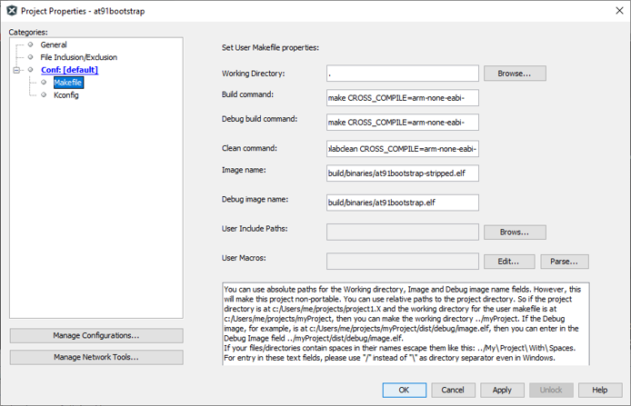
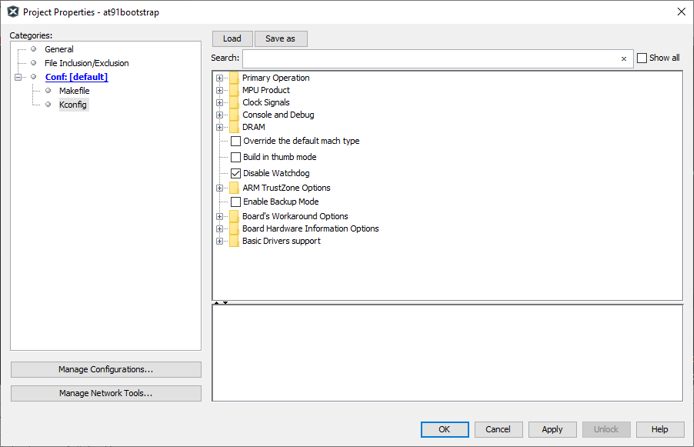
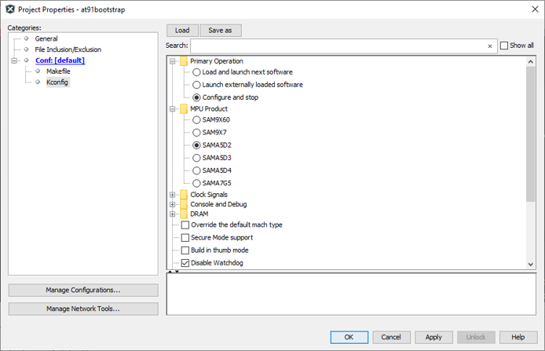
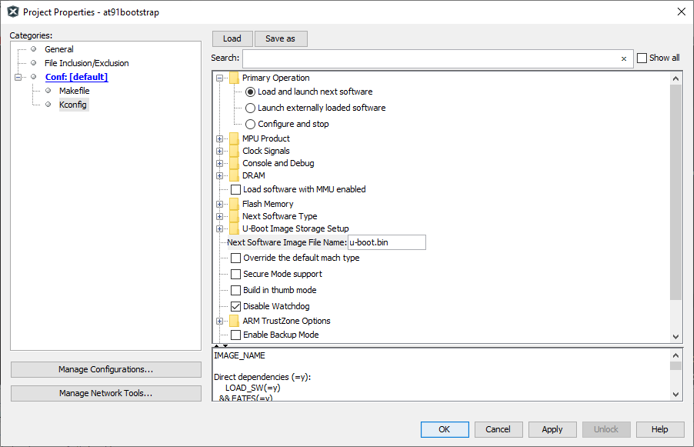

# Building AT91Bootstrap Project Using MPLABx

-   Open a console and execute the following command to clone at91bootstrap repository into a directory named at91bootstrap.X

    ``` {#CODEBLOCK_GPF_NRT_HZB}
     git clone https://github.com/linux4sam/at91bootstrap at91bootstrap.X
    ```

-   Open at91bootstrap.X directory as project in MPLABx

## Configure Compiler

-   Open project properties window, and choose “Makefile� option to configure the compiler:

    

-   Default option is configured to use ARM gcc. To use xc32, replace all instances of arm-none-eabi- to xc32- as follows

    


**Note:** *For the build to be successful, the configured compiler should be available in the system path.*

## Configure Target

-   Open project properties window, and choose “Kconfig� option to configure the build target:

    

-   Click on “LOAD� button and navigate to the configs folder inside at91bootstrap.X directory. You need to choose the default configuration file\(defconfig\) based on what you need the at91boostrap to do

    **Debug/Run application from within MPLABx**

    -   Load *\{evaluation\_kit\}\_bkpt\_none\_defconfig*. For example, on SAMA5D29 Curiosity Development Board, select **sama5d2\_curiosity\_bkptnone\_defconfig** as the configuration file
    -   Click on “Apply� and “OK� buttons to configure the project

        

    -   You can see that the MPU product is now selected as “SAMA5D2� and the primary operation is selected as “Configure and Stop�
    **Load and Run application from an SD card**

    -   Load *\{evaluation\_kit\}sd\_uboot\_defconfig*. For example, on SAMA5D29 Curiosity Development Board, select **sama5d29\_curiositysd\_uboot\_defconfig** as the configuration file
    -   Click on “Apply� and “OK� buttons to configure the project

        

    -   You can see that the MPU product is now selected as “SAMA5D2� and the primary operation is selected as “Load and launch next software�
    -   Edit the Option “Next Software Image File Name� from *u-boot.bin* to *harmony.bin*

        


## Build Target

Once the target configuration is applied in the properties window, you can build the<br /> at91boostrap just like any other MPLABx project. After the build is complete, you<br /> can find the generated binary files under build/binaries directory.

