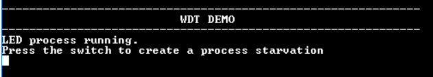
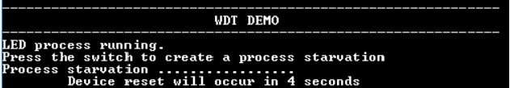

# WDT Timeout

This example application shows how to generate a Watchdog timer reset by emulating a  deadlock.

**Parent topic:**[Harmony 3 Peripheral Library Application Examples for SAMA5D2 Family](GUID-3730E5D6-911C-4BCA-9955-26D7EB66B585.md)

## Description

This example application shows how the WDT peripheral library resets the watchdog  timer by not feeding the watchdog on switch press. The application sets up the  watchdog to reset the device. The application also sets up the timer to blink an LED  to emulate a process. A user switch press forces the device to wait in an infinite  loop to emulate a deadlock. As a result a device reset is triggered as the watchdog  counter overflows the bounded value.

## Downloading and Building the Application

To clone or download this application from Github, go to the [main page of this repository](https://github.com/Microchip-MPLAB-Harmony/csp_apps_sam_a5d2) and then  click Clone button to clone this repository or download as zip file. This content  can also be downloaded using content manager by following these [instructions](https://github.com/Microchip-MPLAB-Harmony/contentmanager/wiki).

Path of the application within the repository is  **apps/wdt/wdt\_timeout/firmware**.

To build the application, refer to the following table and open the project using its  IDE.

|Project Name|Description|
|------------|-----------|
|sam\_a5d2\_curiosity.X|MPLABX project for [SAMA5D29 Curiosity Development Board Kit](https://www.microchip.com/en-us/development-tool/EV07R15A)|

## Setting Up AT91Bootstrap Loader

To load the application binary onto the target device, we need to use at91bootstrap  loader. Refer to the [at91bootstrap loader documentation](GUID-DA6B998E-C5DD-4566-BB08-7DC124553FBF.md) for  details on how to configure, build and run bootstrap loader project and use it to  bootstrap the application binaries.

## Setting Up the Hardware

The following table shows the target hardware for the application projects.

|Project Name|Description|
|------------|-----------|
|sam\_a5d2\_curiosity.X|[SAMA5D29 Curiosity Development Board Kit](https://www.microchip.com/en-us/development-tool/EV07R15A)|

### Setting Up SAMA5D29 Curiosity Development Board

**ADDITIONAL HARDWARE REQUIRED**

-   SD Card with FAT32 file system

**SETTING UP THE SD CARD**

-   Download harmony MPU bootstrap loader
-   Copy the downloaded boot loader binary\( boot.bin\) onto the SD card

**SETTING UP THE BOARD**

-   SDMMC slot used for bootloading the application is SDMMC0
-   Connect the Debug USB port on the board to the computer using a Type-C USB cable
-   Connect the UART Debug port on the board to the computer using a FTDI USB cable

## Running the Application

1.  Build the application using its IDE
2.  Copy the output binary \(named ‘harmony.bin’\) onto the SD Card \(Refer to the ‘Setting up hardware’ section above for setting up the SD card\)
3.  Insert the SD card into SDMMC slot on the board \(Refer to the ‘Setting up hardware’ section for the correct SDMMC slot\)
4.  Open the Terminal application \(Ex.:Tera term\) on the computer.
5.  Connect to the Virtual COM port and configure the serial settings as follows:
    -   Baud : 115200
    -   Data : 8 Bits
    -   Parity : None
    -   Stop : 1 Bit
    -   Flow Control : None
6.  Reset the board to run the application
7.  LED should be blinking and the console displays the following message

    

8.  Press the switch to put the system in a deadlock
9.  LED should stop blinking and the console should print the following message

    

10. WDT will reset the device in four seconds and the demonstration should restart

Following table provides details of Switch and LED names:

|Board|Switch Name|LED Name|
|-----|-----------|--------|
|[SAMA5D29 Curiosity Development Board](https://www.microchip.com/en-us/development-tool/EV07R15A)|USER|RGB\_LED \(Blue\)|

