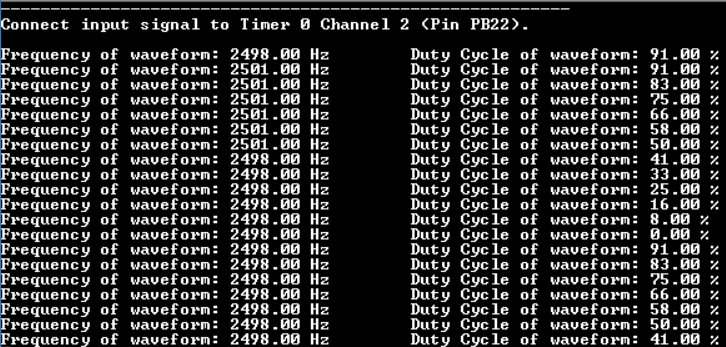

# TC Capture Mode

This example application shows how to use the TC module in capture mode to measure duty  cycle and frequency of an external input.

**Parent topic:**[Harmony 3 Peripheral Library Application Examples for SAMA5D2 Family](GUID-3730E5D6-911C-4BCA-9955-26D7EB66B585.md)

## Description

The TC channel is configured in capture mode to measure duty cycle and frequency of  the PWM signal. The PWM signal is generated using another TC channel which is  configured in compare mode. Output of the compare TC channel is connected to input  of the capture TC channel.

## Downloading and Building the Application

To clone or download this application from Github, go to the [main page of this repository](https://github.com/Microchip-MPLAB-Harmony/csp_apps_sam_a5d2) and then  click Clone button to clone this repository or download as zip file. This content  can also be downloaded using content manager by following these [instructions](https://github.com/Microchip-MPLAB-Harmony/contentmanager/wiki).

Path of the application within the repository is  **apps/tc/tc\_capture\_mode/firmware**.

To build the application, refer to the following table and open the project using its  IDE.

|Project Name|Description|
|------------|-----------|
|sam\_a5d2\_curiosity.X|MPLABX project for [SAMA5D29 Curiosity Development Board Kit](https://www.microchip.com/en-us/development-tool/EV07R15A)|

## Setting Up AT91Bootstrap Loader

To load the application binary onto the target device, we need to use at91bootstrap  loader. Refer to the [at91bootstrap loader documentation](GUID-DA6B998E-C5DD-4566-BB08-7DC124553FBF.md) for  details on how to configure, build and run bootstrap loader project and use it to  bootstrap the application binaries.

## Setting Up the Hardware

The following table shows the target hardware for the application projects.

|Project Name|Description|
|------------|-----------|
|sam\_a5d2\_curiosity.X|[SAMA5D29 Curiosity Development Board Kit](https://www.microchip.com/en-us/development-tool/EV07R15A)|

### Setting Up SAMA5D29 Curiosity Development Board

**SETTING UP THE BOARD**

-   Connect the UART Debug port on the board to the computer using a FTDI to USB cable
-   Connect the Debug USB port on the board to the computer using a Type-C USB cable
-   Use a jumper wire to connect PIN5 of MikroBus1 \(J19\) with PIN26 of J24.

## Running the Application

1.  Build the application using its IDE
2.  Open the Terminal application \(Ex.:Tera term\) on the computer.
3.  Connect to the Virtual COM port and configure the serial settings as follows:
    -   Baud : 115200
    -   Data : 8 Bits
    -   Parity : None
    -   Stop : 1 Bit
    -   Flow Control : None
4.  Console displays frequency and duty cycle of input signal as shown below

    

5.  Frequency is constant \(~2500 Hz\) and duty cycle changes by ~8%

