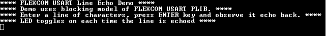

# FLEXCOM USART Blocking

This example application shows how to use the FLEXCOM module in USART mode.

**Parent topic:**[Harmony 3 Peripheral Library Application Examples for SAMA5D2 Family](GUID-3730E5D6-911C-4BCA-9955-26D7EB66B585.md)

## Description

This application configures the FLEXCOM peripheral in USART mode and performs read  and write operation in a blocking manner. The CPU polls the peripheral register  continuously to manage the transfer. It receives a line of characters from the  terminal window and echoes them back.

## Downloading and Building the Application

To clone or download this application from Github, go to the [main page of this repository](https://github.com/Microchip-MPLAB-Harmony/csp_apps_sam_a5d2) and then  click Clone button to clone this repository or download as zip file. This content  can also be downloaded using content manager by following these [instructions](https://github.com/Microchip-MPLAB-Harmony/contentmanager/wiki).

Path of the application within the repository is  **apps/flexcom/usart/flexcom\_usart\_echo\_blocking/firmware**.

To build the application, refer to the following table and open the project using its  IDE.

|Project Name|Description|
|------------|-----------|
|sam\_a5d2\_curiosity.X|MPLABX project for [SAMA5D29 Curiosity Development Board Kit](https://www.microchip.com/en-us/development-tool/EV07R15A)|

## Setting Up AT91Bootstrap Loader

To load the application binary onto the target device, we need to use at91bootstrap  loader. Refer to the [at91bootstrap loader documentation](GUID-DA6B998E-C5DD-4566-BB08-7DC124553FBF.md) for  details on how to configure, build and run bootstrap loader project and use it to  bootstrap the application binaries.

## Setting Up the Hardware

The following table shows the target hardware for the application projects.

|Project Name|Description|
|------------|-----------|
|sam\_a5d2\_curiosity.X|[SAMA5D29 Curiosity Development Board Kit](https://www.microchip.com/en-us/development-tool/EV07R15A)|

### Setting Up SAMA5D29 Curiosity Development Board

**ADDITIONAL HARDWARE REQUIRED**

-   [USB UART click board](http://www.mikroe.com/usb-uart-click)

**SETTING UP THE BOARD**

-   Connect the Debug USB port on the board to the computer using a Type-C USB cable
-   Connect [USB UART click board](http://www.mikroe.com/usb-uart-click) to SAM A5D29 Curiosity board as per below Pin Connections

    |SAM A5D29 Curiosity  Development board Pins|[USB UART click board](http://www.mikroe.com/usb-uart-click)  Pins|
    |--------------------------------------------------------------|-------------------------------------------------------------------------------------|
    |PIN 5, J8  connector|RX|
    |PIN 4, J8  connector|TX|
    |PIN 7, mikroBUS1  connector|3.3V|
    |PIN 1, J8  connector|GND|

-   Connect the Mini USB connector on the [USB UART click board](http://www.mikroe.com/usb-uart-click) to the computer using a Mini USB cable

## Running the Application

1.  Build the application using its IDE
2.  Open the Terminal application \(Ex.:Tera term\) on the computer.
3.  Connect to the Virtual COM port and configure the serial settings as follows:
    -   Baud : 115200
    -   Data : 8 Bits
    -   Parity : None
    -   Stop : 1 Bit
    -   Flow Control : None
4.  The console displays the following message

    

5.  Type a line of characters and press the Enter key

    **Note:** *Number of characters entered before pressing enter key must be less than 256.*

6.  Entered line will be echoed back and the LED is toggled

The following table provides the LED name:

|Board|LED Name|
|-----|--------|
|[SAMA5D29 Curiosity Development Board](https://www.microchip.com/en-us/development-tool/EV07R15A)|RGB\_LED \(Green\)|

