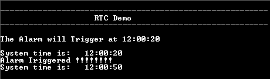

# RTC Alarm Interrupt

This example application shows how to use the RTC to configure the time and generate the  alarm.

**Parent topic:**[Harmony 3 Peripheral Library Application Examples for SAMA5D2 Family](GUID-3730E5D6-911C-4BCA-9955-26D7EB66B585.md)

## Description

This example application shows how to setup system time and configure alarm using the  RTC Peripheral Library. The application sets up an alarm to be generated after 20  seconds of the configured system time. The application displays a message on the  alarm trigger.

## Downloading and Building the Application

To clone or download this application from Github, go to the [main page of this repository](https://github.com/Microchip-MPLAB-Harmony/csp_apps_sam_a5d2) and then  click Clone button to clone this repository or download as zip file. This content  can also be downloaded using content manager by following these [instructions](https://github.com/Microchip-MPLAB-Harmony/contentmanager/wiki).

Path of the application within the repository is  **apps/rtc/rtc\_alarm/firmware**.

To build the application, refer to the following table and open the project using its  IDE.

|Project Name|Description|
|------------|-----------|
|sam\_a5d2\_curiosity.X|MPLABX project for [SAMA5D29 Curiosity Development Board Kit](https://www.microchip.com/en-us/development-tool/EV07R15A)|

## Setting Up AT91Bootstrap Loader

To load the application binary onto the target device, we need to use at91bootstrap  loader. Refer to the [at91bootstrap loader documentation](GUID-DA6B998E-C5DD-4566-BB08-7DC124553FBF.md) for  details on how to configure, build and run bootstrap loader project and use it to  bootstrap the application binaries.

## Setting Up the Hardware

The following table shows the target hardware for the application projects.

|Project Name|Description|
|------------|-----------|
|sam\_a5d2\_curiosity.X|[SAMA5D29 Curiosity Development Board Kit](https://www.microchip.com/en-us/development-tool/EV07R15A)|

### Setting Up SAMA5D29 Curiosity Development Board

**SETTING UP THE BOARD**

-   Connect the Debug USB port on the board to the computer using a Type-C USB cable

## Running the Application

1.  Build the application using its IDE
2.  The console displays the current time and the alarm time \(System time starts at 12:00:00 and gets updated every second\)

    

3.  Once the alarm time is reached, it print the alarm message and turns on the LED \(System time keeps updating\)

    

Refer to the following table for LED name:

|Board|LED Name|
|-----|--------|
|[SAMA5D29 Curiosity Development Board](https://www.microchip.com/en-us/development-tool/EV07R15A)|RGB\_LED \(Blue\)|

