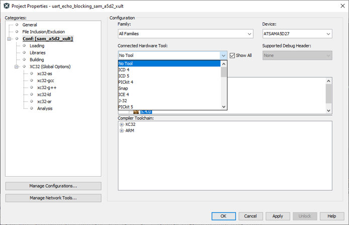
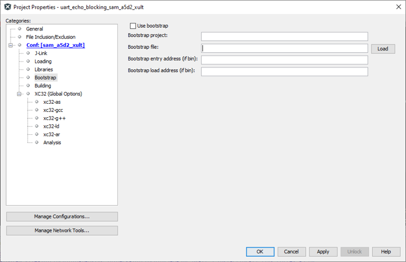
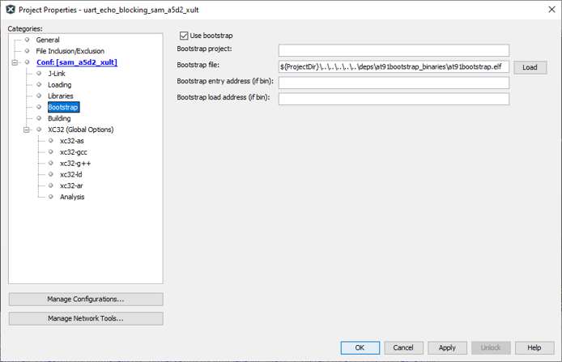

# Using AT91Boostrap Loader with Harmony 3 MPU Applications

MPU harmony3 applications are compiled and linked to execute from external DRAM memory  that is available on the corresponding evaluation kit. This require all peripherals and  clock leading to the DRAM memory to be configured prior to the application being  programmed into DRAM. This is achieved using a bootstrap loader. We use [AT91bootstrap](https://github.com/linux4sam/at91bootstrap) loader for this purpose.

We have deployed the following pre-built bootstrap binaries inside our application  repositories. They can be found under deps folder at the root of the repository.

|Binary Name|Description|
|-----------|-----------|
|at91bootstrap.elf|Bootstrap which allows debug or run  application using MPLABx|
|boot.bin|Bootstrap which allows booting  application using an SD Card|

To use at91boostrap to load and run harmony applications from MPLABx, it should be build  with **bkpt\_none\_defconfig** configuration. If you are interested in building  at91bootstrap using MPLABx, you can read about it [here](GUID-610BD9E4-8CFE-4D10-BE3A-618B04D516CF.md).

## Configure a Debug Tool

-   Open the MPLABx application that you want to debug or run in MPLABx.
-   Right click on the application project and select properties. This will open the properties window. In the configuration option –\> connected hardware tools, select the debugger.

    

    **Note:** *If no debugger is connected, click on the __show all__ check box and select the supported debugger.*

-   Select the target toolchain and click on apply to save the changes
-   This will result in an additional menu option to be available in the configuration tree view called **bootstrap** as shown below:

    

## Configure a Bootstrap

-   Click on **Use bootstrap** check box to enable bootstrap support
-   Click on the **LOAD** button to load the bootstrap file. This will open a file picker, which allows you to choose the bootstrap binary file.
-   Navigate to the \{repository root\}/deps/\{board name\}/at91bootstrap\_binaries folder as explained in the previous section. You should choose **at91bootstrap.elf** file \(The **Bootstrap entry address** and the **Bootstrap load address** text box can be left empty as this information will be read from the ELF file automatically\)

    

## Run/Debug MPU Applications Using MPLABx

You can now Run/Debug the MPU application just like any other MPLABx applications.  When executed, MPLABx performs a two stage loading:

**Stage 1:** Loads the bootstrap loader into the internal SRAM and executes it.  This will configure the board specific peripherals and memory

**Stage 2:** Loads the application into the external DRAM and debugs it. User can  perform actions like setting breakpoints, single-stepping etc.

When using MPLABx to debug a harmony application, you will face the following  limitations:

-   Call stack is not fully supported yet, hence stepping in and out of functions may not work correctly.

## Boot to Application Using SD Card

Copy both the application binary named **harmony.bin** and the bootstrap binary  named **boot.bin** onto an SD card. Insert the SD card into the SD slot of the  evaluation kit and press the reset button.

The ROM bootloader will copy the bootstrap binary **boot.bin** into the internal  SRAM and executes it. The bootstrap will configure the external DRAM and the  required peripherals, then copy the application binary **harmony.bin** into the  DRAM and executes it.

