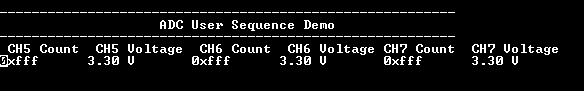

# ADC User Sequence

This example application shows how to sample three analog inputs using the user sequencer  in software trigger mode and send the converted data to the console.

**Parent topic:**[Harmony 3 Peripheral Library Application Examples for SAMA5D2 Family](GUID-3730E5D6-911C-4BCA-9955-26D7EB66B585.md)

## Description

Conversion of the three analog inputs is triggered from software trigger at every 500  ms. The user sequencer is used to define the order of conversion:

|Board|Sequence of conversion|
|-----|----------------------|
|[SAMA5D29 Curiosity Development Board Kit](https://www.microchip.com/en-us/development-tool/EV07R15A)|AD5 –\> AD6 –\> AD7|

Analog input voltage in the range of 0V to 3.3V is fed to the ADC input channel AD5,  AD6 and AD7. ADC conversion result is displayed on the console.

## Downloading and Building the Application

To clone or download this application from Github, go to the [main page of this repository](https://github.com/Microchip-MPLAB-Harmony/csp_apps_sam_a5d2) and then  click Clone button to clone this repository or download as zip file. This content  can also be downloaded using content manager by following these [instructions](https://github.com/Microchip-MPLAB-Harmony/contentmanager/wiki).

Path of the application within the repository is  **apps/adc/adc\_user\_sequence/firmware**.

To build the application, refer to the following table and open the project using its  IDE.

|Project Name|Description|
|------------|-----------|
|sam\_a5d2\_curiosity.X|MPLABX project for [SAMA5D29 Curiosity Development Board Kit](https://www.microchip.com/en-us/development-tool/EV07R15A)|

## Setting Up AT91Bootstrap Loader

To load the application binary onto the target device, we need to use at91bootstrap  loader. Refer to the [at91bootstrap loader documentation](GUID-DA6B998E-C5DD-4566-BB08-7DC124553FBF.md) for  details on how to configure, build and run bootstrap loader project and use it to  bootstrap the application binaries.

## Setting Up the Hardware

The following table shows the target hardware for the application projects.

|Project Name|Description|
|------------|-----------|
|sam\_a5d2\_curiosity.X|[SAMA5D29 Curiosity Development Board Kit](https://www.microchip.com/en-us/development-tool/EV07R15A)|

### Setting Up SAMA5D29 Curiosity Development Board

**SETTING UP THE BOARD**

-   Connect the UART Debug port \(J28\) on the board to the computer using a FTDI USB to serial cable.
-   Connect the Debug USB port on the board to the computer using a Type-C USB cable \(to power the board\)
-   Use a jumper wire to connect Pin 37 of J25 \(AD5 is mapped to Port Pin PD24\) to 3.3 V or GND
-   Use a jumper wire to connect Pin 1 of mikroBUS1 J19 \(AD6 is mapped to Port Pin PD25\) to 3.3 V or GND
-   Use a jumper wire to connect Pin 1 of mikroBUS2 J22 \(AD7 is mapped to Port Pin PD26\) to 3.3 V or GND

## Running the Application

1.  Build the application using its IDE
2.  Open the Terminal application \(Ex.:Tera term\) on the computer.
3.  Connect to the Virtual COM port and configure the serial settings as follows:
    -   Baud : 115200
    -   Data : 8 Bits
    -   Parity : None
    -   Stop : 1 Bit
    -   Flow Control : None
4.  The console displays the ADC Count and the ADC Input Voltage

    

