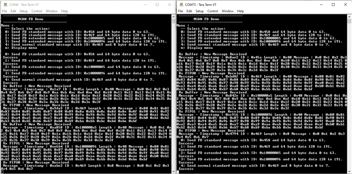

# MCAN FD Blocking

This example application shows how to use the MCAN module to transmit and receive CAN FD  messages in polling mode.

**Parent topic:**[Harmony 3 Peripheral Library Application Examples for SAMA5D2 Family](GUID-3730E5D6-911C-4BCA-9955-26D7EB66B585.md)

## Description

This application transmits and receives CAN FD messages on the CAN bus. To run this  application, two evaluation boards of same type are required. These boards acts as  different nodes on the CAN bus. Same application is programmed onto both the boards.  Boards are connected to PC via UART. While running the application, user can send  and receive CAN FD messages between the boards using UART console applications  running on the PC.

## Downloading and Building the Application

To clone or download this application from Github, go to the [main page of this repository](https://github.com/Microchip-MPLAB-Harmony/csp_apps_sam_a5d2) and then  click Clone button to clone this repository or download as zip file. This content  can also be downloaded using content manager by following these [instructions](https://github.com/Microchip-MPLAB-Harmony/contentmanager/wiki).

Path of the application within the repository is  **apps/mcan/mcan\_fd\_operation\_blocking/firmware**.

To build the application, refer to the following table and open the project using its  IDE.

|Project Name|Description|
|------------|-----------|
|sam\_a5d2\_curiosity.X|MPLABX project for [SAMA5D29 Curiosity Development Board Kit](https://www.microchip.com/en-us/development-tool/EV07R15A)|

## Setting Up AT91Bootstrap Loader

To load the application binary onto the target device, we need to use at91bootstrap  loader. Refer to the [at91bootstrap loader documentation](GUID-DA6B998E-C5DD-4566-BB08-7DC124553FBF.md) for  details on how to configure, build and run bootstrap loader project and use it to  bootstrap the application binaries.

## Setting Up the Hardware

The following table shows the target hardware for the application projects.

|Project Name|Description|
|------------|-----------|
|sam\_a5d2\_curiosity.X|[SAMA5D29 Curiosity Development Board Kit](https://www.microchip.com/en-us/development-tool/EV07R15A)|

### Setting Up SAMA5D29 Curiosity Development Board

**ADDITIONAL HARDWARE REQUIRED**

-   To run the demo, the following additional hardware are required:
    -   [SAMA5D29 Curiosity Development Board Kit](https://www.microchip.com/en-us/development-tool/EV07R15A) - 2 No's
    -   [ATA6563 click board](https://www.mikroe.com/ata6563-click) - 2 No's

**SETTING UP THE BOARD**

-   Connect [ATA6563 click board](https://www.mikroe.com/ata6563-click) to the [SAMA5D29 Curiosity Development Board Kit](https://www.microchip.com/en-us/development-tool/EV07R15A) as per the Pin connections shown below

    |[SAMA5D29 Curiosity Development Board](https://www.microchip.com/en-us/development-tool/EV07R15A)|[ATA6563 click Board](https://www.mikroe.com/ata6563-click)|
    |-------------------------------------------------------------------------------------------------|-----------------------------------------------------------|
    |CANTX0 \(PIN4\),  mikroBUS1 Connector|RX \(PIN 14\)|
    |CANRX0 \(PIN6\),  mikroBUS1 Connector|TX \(PIN 13\)|
    |3V3 \(PIN7\), mikroBUS1 Connector|3V3 \(PIN 7\)|
    |VDD\_5V \(PIN10\),  mikroBUS1 Connector|5V \(PIN 10\)|
    |GND \(PIN8\), mikroBUS1 Connector|GND \(PIN 9\)|

-   Connect [ATA6563 click Board](https://www.mikroe.com/ata6563-click) to each other using DB9 serial cable
-   Connect the Debug USB port on the board to the computer using a Type-C USB cable
-   Connect the UART Debug port on the board to the computer using a FTDI to USB cable

## Running the Application

1.  Build the application using its IDE
2.  Open the Terminal application \(Ex.:Tera term\) on the computer.
3.  Connect to theVirtual COM port and configure the serial settings as follows:
    -   Baud : 115200
    -   Data : 8 Bits
    -   Parity : None
    -   Stop : 1 Bit
    -   Flow Control : None
4.  In the console associated with board 1, press "0" to transmit a CAN FD message
5.  Transmitted message description and status will be displayed in the console window of board 1
6.  Received message will be displayed in the console window of board 2
7.  Follow the sequence below to send and receive different messages:
    -   Press '1' on board 1
    -   Press '2' on board 1
    -   Press '3' on board 1
    -   Press '4' on board 1
    -   Press '0' on board 2
    -   Press '1' on board 2
    -   Press '2' on board 2
    -   Press '3' on board 2
    -   Press '4' on board 2
8.  If the steps are executed in this sequence, the final output in the consoles will be as below \(console on the left is the transmitter \(board 1\) and the one on the right is receiver \(board 2\)\):

  

